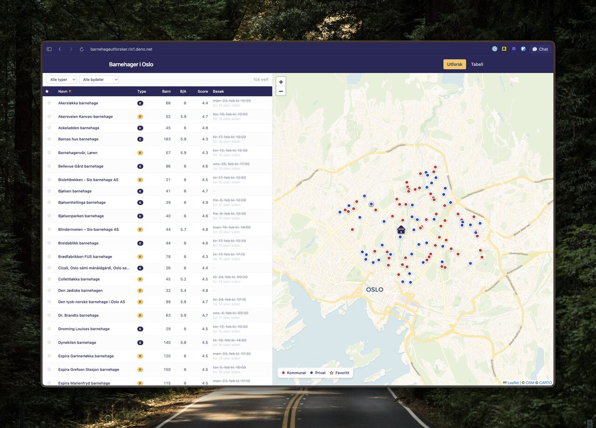

# Barnehager i Oslo

Browse and compare kindergartens in Oslo. Data scraped from
[oslo.kommune.no](https://www.oslo.kommune.no/barnehage/finn-barnehage-i-oslo/).



## Features

- **Explore view** — split-screen with sortable table (left) and interactive map
  (right). Hover a row to highlight its pin, click to pan and see details.
- **Table view** — full-width sortable table with filters for type
  (Kommunal/Privat) and district (bydel).
- **Favorites** — star kindergartens to keep track of them. Stored in the URL
  (`?f=1,2,4`) so you can share your list.
- **Your location** — shows your position on the map (requires geolocation
  permission).

## Tech stack

- [Deno](https://deno.com) + [Fresh 2](https://fresh.deno.dev) +
  [Preact](https://preactjs.com)
- [Tailwind CSS v4](https://tailwindcss.com)
- [Leaflet](https://leafletjs.com) with
  [CartoDB Voyager](https://carto.com/basemaps) tiles
- Data stored as static JSON (scraped from oslo.kommune.no into SQLite, then
  exported)

## Requirements

- [Deno](https://docs.deno.com/runtime/getting_started/installation)
- [litecli](https://litecli.com) — for interactive SQLite querying
  (`pip install litecli` or `brew install litecli`)

## Development

```sh
deno task dev
```

## Build & deploy

The project deploys to [Deno Deploy](https://deno.com/deploy) via GitHub
integration:

1. Push to `main`
2. Deno Deploy builds automatically using:

```sh
deno task build
```

Build output is in `_fresh/`. The deploy entrypoint is `_fresh/server.js`.

## Scraper

To re-scrape kindergarten data from oslo.kommune.no:

```sh
deno task scrape
```

This populates `barnehager.db`. Then export to JSON:

```sh
deno task export
```
